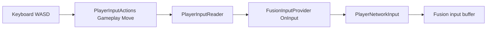
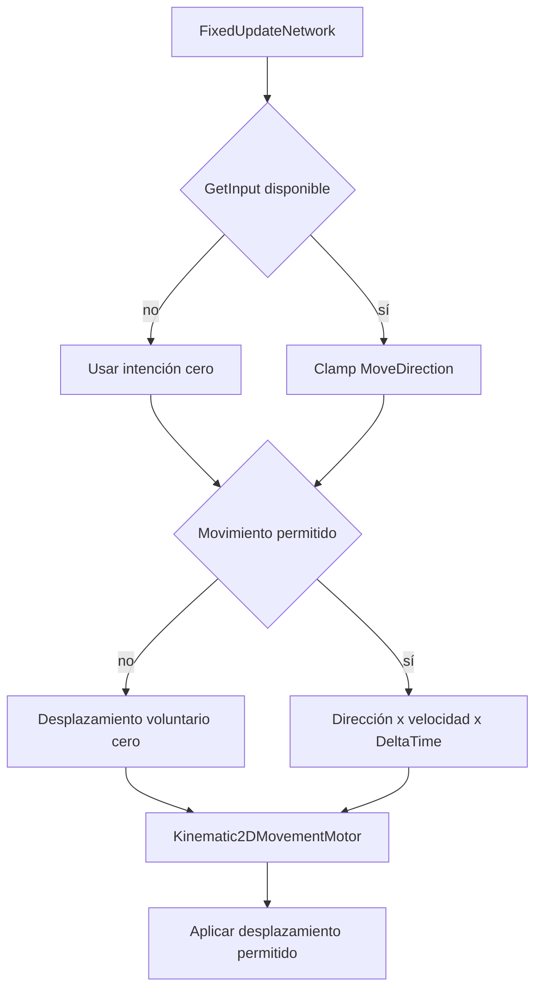
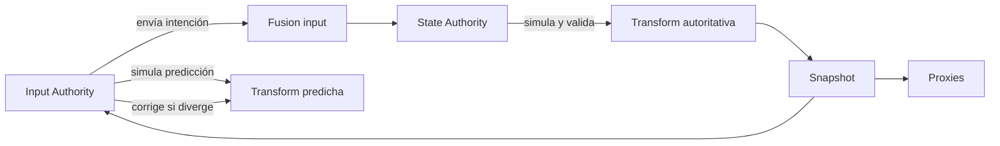
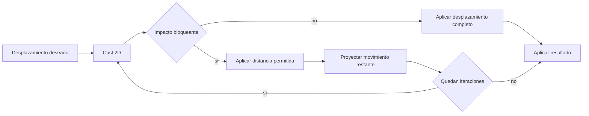
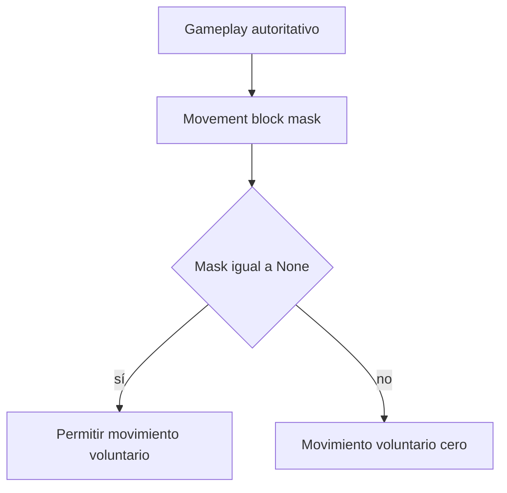
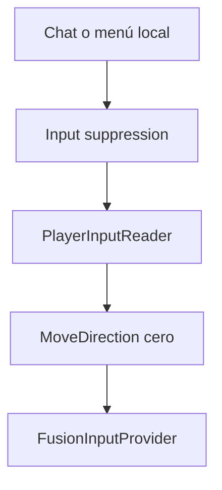
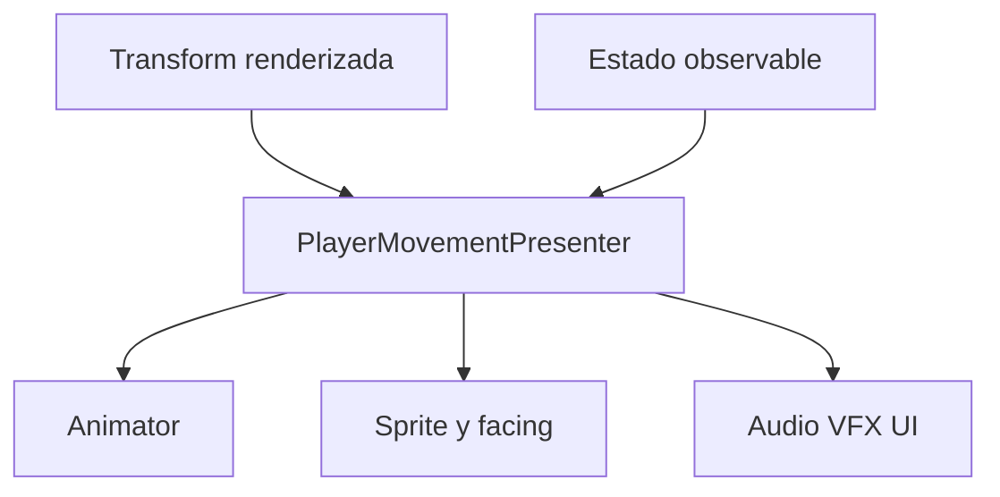
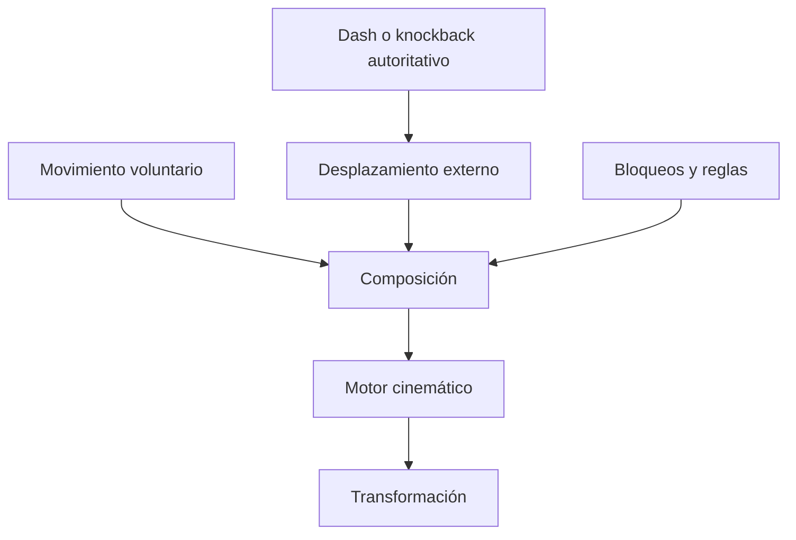

# Player Movement Architecture

## 1. Propósito

Este documento define la arquitectura v1 del movimiento sincronizado de jugadores para Project Grimhold.

El objetivo es implementar movimiento 2D top-down compatible con Photon Fusion, predicción y resimulación, manteniendo separadas las responsabilidades de entrada, transporte de red, simulación, colisiones, configuración y presentación.

La arquitectura debe ser suficientemente simple para la primera versión, pero conservar límites estables que permitan incorporar nuevas mecánicas sin reemplazar el flujo completo.

La decisión principal es:

- `PlayerInputReader` captura la intención local mediante Unity Input System.
- `FusionInputProvider` entrega esa intención a Fusion como `PlayerNetworkInput`.
- `NetworkPlayerMovementController` consume el input durante `FixedUpdateNetwork`.
- `Kinematic2DMovementMotor` aplica el desplazamiento y resuelve colisiones.
- State Authority determina el resultado autoritativo.
- Input Authority puede ejecutar la misma simulación de forma predicha.
- `NetworkTransform`, si se incorpora al prefab, replica e interpola la transformación simulada.
- `PlayerMovementPresenter` observa el estado producido y actualiza únicamente la representación visual.

---

## 2. Alcance de v1

La primera implementación debe cumplir estos criterios:

1. Recibir una intención de movimiento.
2. Limitar la intención a una magnitud válida.
3. Aplicar una velocidad configurable.
4. Resolver colisiones contra el mundo.
5. Separar movimiento y representación visual.
6. Permitir impedir el movimiento de forma controlada.
7. Sincronizar el resultado entre jugadores conectados.
8. Mantener predicción local para el jugador con Input Authority.
9. Ser compatible con resimulación de Fusion.

Quedan fuera de alcance para v1:

- Colisiones entre jugadores.
- Dash.
- Knockback.
- Sprint.
- Aceleración o inercia.
- Buffs y debuffs de velocidad.
- Superficies especiales.
- Movimiento por habilidades.
- Root motion.
- Un Event Bus general.
- Un pipeline genérico de modificadores.
- Una máquina de estados completa de locomoción.
- Un sistema genérico de controladores intercambiables.

Estos elementos se consideran puntos de extensión, no requisitos de la primera implementación.

---

## 3. Estado actual confirmado del repositorio

Hechos verificados en el proyecto:

- Unity: `6000.5.1f1`, según `ProjectSettings/ProjectVersion.txt`.
- Photon Fusion: `2.1.1 Stable 2177`, según `Assets/Photon/Fusion/build_info.txt`.
- Unity Input System: `1.19.0`, según `Packages/manifest.json`.
- `NetworkProjectConfig.fusion` se encuentra en `Assets/Photon/Fusion/Resources/NetworkProjectConfig.fusion`.
- `PhysicsForecast` está deshabilitado.
- Lag Compensation está deshabilitado.
- La sesión usa `GameMode.AutoHostOrClient`.
- `FusionSessionLauncher` crea el `NetworkRunner` en runtime.
- `NetworkRunner.ProvideInput` está habilitado.
- El launcher registra `FusionInputProvider` y `NetworkPlayerSpawner` como callbacks.
- `NetworkPlayerSpawner` crea jugadores solamente desde host/servidor.
- El jugador que se conecta recibe Input Authority mediante `runner.Spawn(..., player)`.
- El objeto creado se registra mediante `runner.SetPlayerObject`.

Flujo actual de entrada:

```text
Unity Input System
    → PlayerInputReader
    → FusionInputProvider.OnInput
    → PlayerNetworkInput
    → Fusion input buffer
```

El asset `PlayerInputActions.inputactions` define actualmente:

- Action Map: `Gameplay`.
- Acción: `Move`.
- Tipo: `Vector2`.
- Bindings: WASD.

`PlayerNetworkInput` contiene actualmente:

- `MoveDirection`.
- `LookRotation`.
- `Buttons`.

`PlayerInputReader` actualiza `MoveDirection`. No se confirmó todavía una lectura efectiva de look, fire o interact desde el asset de Input System actual.

El prefab `Assets/Prefabs/NetworkPlayer.prefab` contiene:

- `NetworkObject` en la raíz.
- Un hijo visual `Body`.
- `SpriteRenderer` en el hijo visual.

El prefab todavía no contiene:

- `NetworkTransform`.
- `Rigidbody2D`.
- `Collider2D`.
- Controlador de movimiento.
- Motor de colisiones.
- Presenter de movimiento.

`NetworkTransform` está disponible en la instalación actual de Fusion.

`NetworkRigidbody2D` no fue encontrado entre los tipos instalados en el proyecto. Esto describe el estado del repositorio actual y no implica que el componente no exista en addons u otras distribuciones de Fusion.

`ProjectSettings/TagManager.asset` no define todavía layers específicas para mundo, jugadores u obstáculos de movimiento.

---

## 4. Objetivos arquitectónicos

La arquitectura debe:

- Mantener desacoplada la lectura de dispositivos respecto del movimiento.
- Mantener Fusion fuera del motor de colisiones.
- Ejecutar la simulación dentro del ciclo de ticks de Fusion.
- Conservar una única fuente autoritativa para la posición.
- Evitar sincronizar valores que puedan derivarse.
- Permitir configurar el movimiento sin modificar código.
- Mantener la presentación como consumidora de estado.
- Evitar efectos irreversibles dentro de la simulación predicha.
- Evitar dependencias globales.
- Permitir reemplazar la resolución física sin rehacer input o presentación.
- Permitir incorporar desplazamientos externos sin reemplazar el motor base.
- Permitir incorporar restricciones de movimiento sin convertir la UI local en autoridad de gameplay.

La arquitectura no intenta impedir cualquier refactor futuro. Busca que los cambios futuros se concentren en el componente responsable y no se propaguen por toda la cadena.

---

## 5. Principios de diseño

### 5.1 Simulación tick-driven

El movimiento se calcula desde `FixedUpdateNetwork`.

No se mueve al jugador desde:

- `Update`.
- `LateUpdate`.
- Callbacks de Input System.
- Eventos C# de movimiento continuo.
- RPCs enviados cada frame.

### 5.2 Estado autoritativo y predicción

State Authority determina el resultado autoritativo.

Input Authority provee la intención y puede ejecutar la misma lógica de movimiento de forma predicha. La implementación no debe restringir todo el movimiento a `HasStateAuthority`, porque eso eliminaría la predicción local del cliente.

Los proxies:

- No producen input para ese objeto.
- No ejecutan movimiento voluntario propio.
- Consumen estados replicados e interpolados.

### 5.3 Estado de red mínimo

No se agrega una propiedad `[Networked]` solamente porque un valor sea útil visualmente.

Antes de sincronizar un dato se debe comprobar que:

- No pueda derivarse de otro estado.
- Sea necesario para gameplay, corrección o presentación remota.
- Deba formar parte de snapshots y resimulación.

### 5.4 Presentación read-only

Animación, sprites, audio, VFX, UI y cámara leen estado producido por la simulación.

No pueden:

- Aplicar desplazamiento.
- Alterar autoridad.
- Cambiar posición autoritativa.
- Decidir si un input es válido.
- Desbloquear movimiento.

### 5.5 Extensión por composición

Las nuevas mecánicas deben incorporarse mediante datos, estados o fuentes de desplazamiento concretas, no mediante una jerarquía profunda de controladores.

### 5.6 Abstracciones justificadas

No se crean interfaces, factories, services o pipelines sin una variación real.

Una API pública pequeña y estable puede ser suficiente para desacoplar componentes sin introducir una interfaz desde v1.

---

## 6. Arquitectura v1

```text
┌──────────────────────────────────────────────┐
│ PlayerInputReader                            │
│ Captura intención local                      │
└──────────────────────┬───────────────────────┘
                       │ PlayerNetworkInput
                       ▼
┌──────────────────────────────────────────────┐
│ FusionInputProvider                          │
│ Adapta input local a NetworkInput            │
└──────────────────────┬───────────────────────┘
                       │ Fusion input buffer
                       ▼
┌──────────────────────────────────────────────┐
│ NetworkPlayerMovementController              │
│ FixedUpdateNetwork                           │
│ Valida input, restricciones y velocidad      │
└──────────────────────┬───────────────────────┘
                       │ desplazamiento deseado
                       ▼
┌──────────────────────────────────────────────┐
│ Kinematic2DMovementMotor                     │
│ Casts, skin, sliding y desplazamiento        │
└──────────────────────┬───────────────────────┘
                       │ transformación simulada
                       ▼
┌──────────────────────────────────────────────┐
│ NetworkTransform                             │
│ Replicación e interpolación                  │
└──────────────────────┬───────────────────────┘
                       │ estado renderizado
                       ▼
┌──────────────────────────────────────────────┐
│ PlayerAnimatorView                           │
│ Animator, orientación y estado de movimiento │
└──────────────────────────────────────────────┘

               PlayerMovementConfig
            Configuración compartida inmutable
```

---

## 7. Responsabilidades por componente

### 7.1 `PlayerInputReader`

Responsabilidades:

- Crear y administrar `PlayerInputActions`.
- Leer el dispositivo local.
- Mantener la intención local más reciente.
- Acumular botones cuando sea necesario.
- Entregar un `PlayerNetworkInput` cuando Fusion lo consuma.
- Permitir suprimir input local por un contexto estrictamente local.

Dependencias permitidas:

- Unity Input System.
- `PlayerNetworkInput`.
- Tipos propios de entrada.

Dependencias prohibidas:

- `NetworkBehaviour` de movimiento.
- `Rigidbody2D`.
- `Collider2D`.
- `Animator`.
- `SpriteRenderer`.
- Reglas autoritativas de gameplay.

### 7.2 `FusionInputProvider`

Responsabilidades:

- Implementar el borde entre lectura local y Fusion.
- Consumir `PlayerInputReader` desde `OnInput`.
- Escribir `PlayerNetworkInput` en `NetworkInput`.
- Entregar input por defecto cuando no exista un reader válido.

Dependencias permitidas:

- Fusion.
- `PlayerInputReader`.
- `PlayerNetworkInput`.

Dependencias prohibidas:

- Motor de movimiento.
- Presentación.
- Configuración de velocidad.
- Reglas de bloqueo.
- Resolución de colisiones.

### 7.3 `PlayerNetworkInput`

Responsabilidades:

- Transportar intención por tick.
- Contener datos compactos necesarios para simular acciones del jugador.

No debe contener:

- Posición.
- Velocidad simulada.
- Resultado de colisiones.
- Configuración.
- Referencias a objetos Unity.
- Estado visual.
- Razones de bloqueo.

`MoveDirection` debe validarse nuevamente en el borde de simulación, aunque haya sido producido por código local.

### 7.4 `NetworkPlayerMovementController`

Tipo propuesto:

```text
NetworkBehaviour
```

Responsabilidades:

- Ejecutar movimiento desde `FixedUpdateNetwork`.
- Obtener `PlayerNetworkInput` mediante `GetInput`.
- Tratar ausencia de input como intención cero.
- Limitar `MoveDirection` a magnitud máxima uno.
- Evaluar restricciones autoritativas.
- Leer la configuración base.
- Calcular velocidad efectiva para v1.
- Construir el desplazamiento deseado.
- Delegar la resolución física al motor.
- Exponer estado de solo lectura para presentación.
- Mantener únicamente estado `[Networked]` que tenga una necesidad concreta.

No debe:

- Leer directamente Input System.
- Acceder a `Animator` o `SpriteRenderer`.
- Reproducir audio.
- Instanciar VFX.
- Implementar casts directamente si ya existe el motor.
- Publicar eventos para avanzar movimiento.
- Usar `transform.position` sin pasar por la política de colisiones aprobada.

Regla de ejecución:

- State Authority ejecuta y valida el resultado autoritativo.
- Input Authority ejecuta predicción cuando Fusion dispone de su input.
- Proxies no producen movimiento voluntario.
- El código debe tolerar resimulación y ejecutarse de manera repetible para el mismo estado e input.

### 7.5 `Kinematic2DMovementMotor`

Tipo propuesto:

```text
MonoBehaviour
```

Responsabilidades:

- Encapsular referencias a `Rigidbody2D` y `Collider2D`.
- Recibir un desplazamiento deseado.
- Consultar geometría mediante casts 2D.
- Aplicar skin width.
- Limitar el desplazamiento antes del contacto.
- Proyectar movimiento restante sobre superficies para permitir sliding.
- Aplicar el desplazamiento final al cuerpo.
- Devolver información mínima del resultado cuando sea necesaria.

Dependencias permitidas:

- Unity Physics2D.
- `PlayerMovementConfig` o parámetros ya resueltos por el controlador.

Dependencias prohibidas:

- Fusion.
- Input System.
- `PlayerNetworkInput`.
- Presentación.
- Sistemas de habilidades.
- Estado de UI.

El motor no decide si el jugador puede moverse. Solo resuelve cuánto del desplazamiento solicitado puede aplicarse.

### 7.6 `NetworkTransform`

Responsabilidades:

- Capturar la transformación simulada.
- Replicar el estado de transformación.
- Interpolar estados para proxies y renderizado.

No es una fuente de verdad independiente.

La fuente autoritativa es el resultado de simulación aceptado por State Authority. `NetworkTransform` sincroniza ese resultado.

La configuración exacta del componente debe validarse durante la implementación en el prefab y con la versión instalada de Fusion.

### 7.7 `PlayerAnimatorView`

Tipo:

```text
MonoBehaviour
```

Responsabilidades:

- Leer `FacingDirection` e `IsMoving` desde `PlayerMovementNetworkController`.
- Utilizar `LateUpdate` para actualizar de forma desacoplada los parámetros del `Animator`.
- Usar hashes estáticos (`MoveX`, `MoveY`, `IsMoving`) para la actualización de parámetros.
- Tolerar la falta de inicialización o referencias temporales en el editor/escena.

No debe:

- Sincronizar o escribir variables `[Networked]`.
- Modificar posición.
- Leer entrada del jugador.
- Depender de referencias directas de Photon Fusion.

### 7.8 `PlayerMovementConfig`

Tipo propuesto:

```text
ScriptableObject
```

Responsabilidades:

- Almacenar configuración estable y compartida.
- Permitir balancear valores sin cambiar código.

Datos iniciales recomendados:

- `BaseSpeed`.
- `CollisionMask`.
- `SkinWidth`.
- `MaxCastIterations`.

Datos que no debe almacenar:

- Posición actual.
- Velocidad runtime.
- Dirección actual.
- Bloqueos activos.
- Buffs o debuffs activos.
- Cooldowns.
- Referencias a instancias de jugadores.
- Resultados de colisión.

El asset debe considerarse inmutable durante la partida.

---

## 8. Fuentes de verdad

| Dato | Fuente de verdad | Tipo |
| --- | --- | --- |
| Input bruto local | Unity Input System | Local |
| Intención acumulada | `PlayerInputReader` hasta `OnInput` | Local |
| Input por tick | Fusion input buffer con `PlayerNetworkInput` | Simulación |
| Configuración base | `PlayerMovementConfig` | Data-driven |
| Posición autoritativa | Resultado validado por State Authority | Autoritativo |
| Posición predicha | Simulación de Input Authority | Predicha |
| Transformación replicada | Snapshot gestionado por `NetworkTransform` | Replicada |
| Posición renderizada | Interpolación/render de Fusion | Visual |
| Capacidad de movimiento | Estado autoritativo de restricciones | Gameplay |
| Velocidad visual | Derivada del desplazamiento renderizado cuando sea posible | Visual |
| Estado del Animator | `PlayerMovementPresenter` | Visual |

No debe existir una segunda propiedad `[Networked]` que replique la posición si `NetworkTransform` ya cumple esa función.

---

## 9. Modelo de autoridad y predicción

### 9.1 Input Authority

Input Authority:

- Pertenece al jugador asignado durante el spawn.
- Produce `PlayerNetworkInput`.
- Ejecuta predicción local cuando Fusion dispone del input.
- No determina el resultado autoritativo final.
- No puede imponer bloqueos o desplazamientos de gameplay al host por fuera del flujo validado.

### 9.2 State Authority

State Authority:

- Resuelve el resultado autoritativo.
- Aplica reglas de gameplay.
- Mantiene estados `[Networked]` necesarios.
- Corrige predicciones divergentes.
- Autoriza bloqueos y desplazamientos externos.

### 9.3 Proxies

Los proxies:

- No capturan input para el objeto remoto.
- No ejecutan movimiento voluntario propio.
- Reciben snapshots.
- Renderizan estados interpolados.

### 9.4 Restricción de implementación

El controlador no debe tener esta política global:

```csharp
if (!HasStateAuthority)
{
    return;
}
```

aplicada al movimiento completo, porque impediría que Input Authority prediga.

La lógica debe ejecutarse dentro del flujo de simulación de Fusion en los peers que correspondan y usar el resultado de State Authority como resultado definitivo.

---

## 10. Estado local, derivado y sincronizado

### 10.1 Estado local

Ejemplos:

- Input leído por `PlayerInputReader`.
- Supresión local de input.
- Estado interno del presenter.
- Última posición renderizada usada para calcular velocidad visual.
- Referencias cacheadas.

### 10.2 Estado derivado

No se sincroniza mientras pueda calcularse de forma fiable:

- Dirección normalizada.
- `CanMove` a partir de restricciones.
- Velocidad deseada.
- Velocidad efectiva.
- `IsMoving` visual.
- Velocidad renderizada.
- Facing visual.

### 10.3 Estado `[Networked]` candidato

Solo se agrega cuando exista una necesidad concreta:

- Máscara de bloqueos autoritativos.
- Modo de locomoción autoritativo.
- Estado de dash.
- Desplazamiento externo activo.
- Parámetro que afecte gameplay y deba restaurarse durante resimulación.

### 10.4 Estado no aprobado para v1

No sincronizar sin una justificación nueva:

- `SimulatedVelocity`.
- Posición duplicada.
- Configuración completa del ScriptableObject.
- `IsMoving` visual.
- Flip del sprite.
- Estado del Animator.
- Menú abierto localmente.

---

## 11. Intención de movimiento

`PlayerNetworkInput.MoveDirection` representa intención, no velocidad ni desplazamiento.

Contrato:

- Rango esperado por eje: `[-1, 1]`.
- Magnitud máxima aceptada: `1`.
- La simulación vuelve a aplicar clamp.
- El input diagonal no puede producir mayor velocidad.
- Input ausente se interpreta como intención cero, salvo que Fusion requiera otra política explícita.

Cálculo conceptual de v1:

```text
validatedDirection = ClampMagnitude(input.MoveDirection, 1)
effectiveSpeed = config.BaseSpeed
desiredDisplacement = validatedDirection × effectiveSpeed × Runner.DeltaTime
```

Este cálculo puede permanecer en el controlador mientras no existan reglas suficientemente complejas para justificar una clase de simulación independiente.

---

## 12. Configuración data-driven

La configuración base se centraliza en `PlayerMovementConfig`.

Ventajas:

- Evita valores duplicados en prefabs.
- Permite balancear sin cambiar código.
- Facilita variantes de jugador mediante assets distintos.
- Mantiene los datos estables separados del estado runtime.

Reglas:

- El controlador recibe una referencia explícita al asset.
- El asset no se modifica en runtime.
- Los valores se validan mediante atributos y `OnValidate` cuando corresponda.
- No se usan singletons para acceder a la configuración.
- Los modificadores futuros no mutan `BaseSpeed` dentro del asset.

---

## 13. Resolución de colisiones

### 13.1 Estrategia seleccionada para v1

```text
Rigidbody2D Kinematic
+ Collider2D
+ casts iterativos
+ skin width
+ sliding
```

El movimiento es explícito y no depende de fuerzas, masa, drag o fricción del solver.

### 13.2 Flujo de resolución

1. Recibir el desplazamiento deseado.
2. Obtener dirección y distancia.
3. Ejecutar un cast con el collider/cuerpo.
4. Buscar el impacto bloqueante más cercano.
5. Aplicar el desplazamiento permitido menos skin width.
6. Calcular el movimiento restante.
7. Eliminar la componente que apunta hacia la superficie.
8. Repetir hasta alcanzar el máximo de iteraciones.
9. Aplicar el desplazamiento resultante.

### 13.3 Supuestos

- Las colisiones iniciales son principalmente contra geometría estática.
- Todos los peers que predicen comparten geometría equivalente.
- Las layers y colliders relevantes son consistentes entre peers.
- Los triggers no bloquean salvo decisión explícita.
- Las colisiones jugador-jugador no forman parte de v1.

### 13.4 Limitaciones

Unity Physics2D no garantiza determinismo matemático perfecto entre plataformas y configuraciones distintas.

El enfoque se considera aceptable para v1 porque:

- El juego es top-down.
- La interacción física inicial es simple.
- No se utilizan fuerzas complejas.
- Los casts permiten controlar la resolución.
- El host conserva autoridad final.

Debe validarse bajo latencia y resimulación.

---

## 14. Alternativas de movimiento consideradas

### 14.1 `transform.position` directo

No seleccionado.

Problemas:

- No resuelve colisiones por sí mismo.
- Puede atravesar geometría.
- Mezcla aplicación de movimiento con una política física implícita.

### 14.2 `Rigidbody2D` dinámico

No seleccionado para v1.

Problemas:

- Introduce fuerzas, masa, fricción y dependencia del solver.
- Aumenta la complejidad de predicción y corrección.
- No existe un requisito actual de interacción física dinámica.

### 14.3 `NetworkRigidbody2D`

No seleccionado para v1.

Motivos:

- No fue encontrado en la instalación actual del proyecto.
- El movimiento inicial no necesita simulación de rigidbodies dinámica.
- No se instalarán addons para resolver un caso que puede cubrirse con un motor cinemático pequeño.

Esta decisión puede revisarse si aparecen requisitos de física dinámica real.

### 14.4 Controlador cinemático genérico completo

No seleccionado.

Un framework general de locomoción sería desproporcionado para los criterios actuales.

### 14.5 `NetworkTransform`

Seleccionado de forma provisional como mecanismo de sincronización de transformación.

La configuración exacta debe validarse en la implementación y en pruebas host/cliente.

---

## 15. Bloqueos autoritativos

Los bloqueos autoritativos representan reglas de gameplay que impiden movimiento voluntario.

Ejemplos futuros:

- Muerte.
- Stun.
- Root.
- Interacción autoritativa.
- Extracción.
- Transición de gameplay.

Cuando existan múltiples sistemas capaces de bloquear movimiento, debe utilizarse una máscara acumulable:

```csharp
[Flags]
public enum PlayerMovementBlockReason
{
    None = 0,
    Dead = 1 << 0,
    Stunned = 1 << 1,
    Interacting = 1 << 2,
    Extracting = 1 << 3,
    Transition = 1 << 4
}
```

Reglas:

- Agregar una razón no elimina las existentes.
- Retirar una razón no habilita el movimiento si quedan otras.
- La escritura autoritativa pertenece a State Authority.
- La capacidad de movimiento se deriva de que la máscara sea `None`.
- La representación `[Networked]` se agrega cuando el bloqueo exista realmente en gameplay.

Para el criterio inicial “permitir habilitar y deshabilitar control”, se puede implementar una API mínima y compatible con la futura máscara. No es necesario implementar razones que todavía no existen.

---

## 16. Supresión local de input

La supresión local evita que el cliente produzca intención temporalmente.

Ejemplos:

- Chat abierto.
- Menú local.
- Campo de texto enfocado.
- Pérdida de foco.
- Dispositivo desconectado.

Reglas:

- Vive en la capa de input local.
- Produce `MoveDirection = Vector2.zero` cuando corresponde.
- No se convierte automáticamente en estado `[Networked]`.
- No representa stun, muerte o root.
- No modifica reglas autoritativas.

La UI no debe escribir directamente el estado de movimiento de red salvo que exista una regla de gameplay específica que lo requiera.

---

## 17. Presentación state-driven

El movimiento continuo y la orientación se presentan observando el estado sincronizado de red en `LateUpdate`, libre de dependencias de red o input.

Flujo:

```text
FacingDirection & IsMoving ([Networked])
    → PlayerAnimatorView
    → Animator (MoveX, MoveY, IsMoving)
```

El visualizador de animación (`PlayerAnimatorView`):
- Lee `FacingDirection` de `PlayerMovementNetworkController` (usando `Vector2.down` como fallback visual si aún es cero).
- Lee `IsMoving` para controlar las transiciones entre caminar e idle.
- Actualiza los parámetros flotantes y booleanos del Animator.

No se sincronizan clips ni variables visuales directamente; la animación se deriva enteramente del estado simulado.

---

## 18. Uso limitado de eventos

No se implementa un Event Bus general en v1.

Los eventos no son fuente de verdad para:

- Posición.
- Movimiento continuo.
- Velocidad autoritativa.
- Bloqueos.
- Colisiones de gameplay.

Los eventos pueden utilizarse más adelante para sucesos discretos, por ejemplo:

- Muerte confirmada.
- Stun aplicado.
- Dash iniciado.
- Interacción aceptada.
- Extracción iniciada.
- Feedback de un impacto confirmado.

Los efectos generados durante predicción pueden repetirse o invalidarse durante resimulación. Filtrar únicamente por número de tick no garantiza que un efecto predicho siga siendo válido.

Para v1 se prefiere:

- Estado renderizado para locomoción continua.
- Comparación local de estados para transiciones visuales.
- Eventos solamente cuando exista un suceso discreto y una política clara de confirmación o deduplicación.

---

## 19. Contratos mínimos

### 19.1 API del controlador

El controlador debe exponer solo datos necesarios para otros componentes.

Ejemplos posibles:

```csharp
public bool CanMove { get; }
public Vector2 DesiredVelocity { get; }
```

No se exige que estos nombres o propiedades sean `[Networked]`.

### 19.2 API del motor

La API del motor de colisiones es concreta y directa para la v1:

```csharp
public Vector2 Move(Vector2 desiredDisplacement);
```

Retorna el desplazamiento físico neto realmente aplicado tras resolver colisiones, deslizamientos e iteraciones del motor. Esto permite al controlador determinar con precisión si el personaje se desplazó o quedó bloqueado contra una pared.

### 19.3 Interfaces

No se crea `IMovementMotor`, `IMovementStateReader` u otra interfaz en v1 sin una segunda implementación o necesidad concreta.

El límite arquitectónico se conserva mediante:

- Responsabilidades separadas.
- Referencias explícitas.
- API pública pequeña.
- Ausencia de dependencias inversas innecesarias.

Si aparece un segundo motor real, la interfaz puede extraerse en ese momento sin modificar input, configuración o presenter.

---

## 20. Puntos de extensión

### 20.1 Sprint

Componente afectado:

- Cálculo de velocidad efectiva en el controlador.

Extensión prevista:

- Estado autoritativo de sprint.
- Multiplicador configurable.

No debería modificar:

- Input provider.
- Motor de colisiones.
- NetworkTransform.
- Presenter, salvo visuales.

### 20.2 Slow y haste

Componente afectado:

- Cálculo de velocidad efectiva.

Cuando exista el primer modificador real, puede extraerse un pipeline pequeño de modificadores runtime.

No se modifica `PlayerMovementConfig.BaseSpeed` en runtime.

### 20.3 Stun o root

Componente afectado:

- Estado de bloqueos autoritativos.

No debería modificar:

- Motor.
- Input reader.
- Replicación de transformación.

### 20.4 Muerte

Componente afectado:

- Bloqueo autoritativo.
- Presentación.

El presenter observa el estado de muerte o locomoción, pero no lo decide.

### 20.5 Dash

Componente afectado:

- Composición futura de desplazamientos.

Necesidades posibles:

- Estado autoritativo de dash.
- Dirección y duración.
- Desplazamiento externo por tick.
- Política de colisión específica.

No debería reemplazar la cadena de input ni la presentación base.

### 20.6 Knockback

Knockback no es solamente un bloqueo.

Modelo futuro:

```text
movimiento final = movimiento voluntario + desplazamiento externo
```

La intención voluntaria puede ignorarse temporalmente, pero el motor debe continuar aplicando el desplazamiento externo.

### 20.7 Carga de objetos

Componente afectado:

- Velocidad efectiva o modo de locomoción.

La carga no modifica el asset compartido; produce un modificador runtime autoritativo.

### 20.8 Superficies

Componente afectado:

- Fuente futura de modificadores o reglas de movimiento.

No se incorporan al motor hasta existir una regla concreta como slow, hielo o daño.

### 20.9 Bots

Los bots pueden producir intención mediante otra fuente, pero deben entrar al mismo controlador de simulación.

Cuando exista esa segunda fuente real puede extraerse un contrato de intención común.

---

## 21. Crecimiento controlado del controlador

`NetworkPlayerMovementController` puede comenzar con responsabilidades de orquestación simples.

Debe reevaluarse cuando acumule lógica de:

- Modificadores.
- Dash.
- Knockback.
- Múltiples modos de locomoción.
- Movimiento por habilidades.
- Reglas de terreno.

Criterio para extraer una clase de simulación pura:

- Existen reglas no triviales independientes de Unity Physics.
- Las reglas necesitan pruebas unitarias propias.
- Existen múltiples fuentes de desplazamiento.
- El controlador comienza a mezclar orquestación de Fusion con cálculo de dominio.

No se extrae una clase que únicamente ejecute:

```text
direction × speed × deltaTime
```

---

## 22. Estructura de archivos propuesta

```text
Assets/
└── Scripts/
    └── Player/
        ├── Input/
        │   ├── PlayerInputReader.cs
        │   ├── PlayerInputButton.cs
        │   └── PlayerNetworkInput.cs
        │
        ├── Movement/
        │   ├── NetworkPlayerMovementController.cs
        │   ├── Kinematic2DMovementMotor.cs
        │   ├── PlayerMovementConfig.cs
        │   └── PlayerMovementBlockReason.cs
        │
        └── Presentation/
            └── PlayerAnimatorView.cs

Assets/
└── Scripts/
    └── Networking/
        ├── FusionInputProvider.cs
        ├── FusionSessionLauncher.cs
        ├── NetworkPlayerSpawner.cs
        └── NetworkRunnerCallbacksAdapter.cs
```

Notas:

- `PlayerMovementBlockReason.cs` se crea cuando se implemente una máscara de bloqueos.
- No se crea una carpeta de interfaces sin tipos reales.
- No se crea un manager de movimiento.
- No se crea un service locator.
- No se crea una factory para componentes del prefab.

---

## 23. Prefab objetivo

Estructura conceptual:

```text
NetworkPlayer
├── NetworkObject
├── NetworkTransform
├── Rigidbody2D
├── Collider2D
├── NetworkPlayerMovementController
├── Kinematic2DMovementMotor
└── Body
    ├── SpriteRenderer
    ├── Animator
    └── PlayerMovementPresenter
```

Configuración conceptual del cuerpo:

- `Rigidbody2D`: Kinematic.
- Gravity Scale: `0`.
- Rotación física bloqueada si el juego no la utiliza.
- Interpolation de `Rigidbody2D`: debe configurarse en `Interpolate` para asegurar suavizado visual local bajo predicción.
- Collider: forma y tamaño pendientes de definir.
- Collision Mask: pendiente de crear layers reales.

La configuración exacta debe realizarse y validarse durante la implementación.

---

## 24. Diagramas de flujo

### 24.1 Captura y envío de input



### 24.2 Simulación de un tick



### 24.3 Predicción y autoridad



### 24.4 Resolución de colisiones



### 24.5 Bloqueo autoritativo



### 24.6 Supresión local



### 24.7 Presentación



### 24.8 Desplazamiento externo futuro



---

## 25. Matriz de estabilidad

| Decisión | Clasificación | Motivo |
| --- | --- | --- |
| Input transportado con `PlayerNetworkInput` | Estable | Ya está integrado con Fusion |
| Simulación en `FixedUpdateNetwork` | Estable | Necesario para predicción y resimulación |
| State Authority como autoridad final | Estable | Modelo de autoridad Host/Client |
| Predicción en Input Authority | Estable | Evita latencia visible en control local |
| Separación input/simulación/presentación | Estable | Límite arquitectónico principal |
| Configuración en `PlayerMovementConfig` | Estable | Datos compartidos sin estado runtime |
| Estado de red mínimo | Estable | Evita duplicación y snapshots innecesarios |
| Motor cinemático con casts | Provisional aprobada | Adecuado para los requisitos actuales |
| `NetworkTransform` | Provisional aprobada | Debe validarse en prefab y Play Mode |
| Máscara de bloqueos | Extensión cercana | Se agrega cuando exista más de una causa real |
| Pipeline de modificadores | Extensión futura | Solo cuando exista un modificador real |
| Interfaz del motor | Extensión futura | Solo con segunda implementación |
| Event Bus | Descartado para v1 | No existe necesidad concreta |
| Colisión jugador-jugador | Pendiente | Requiere política de diseño y red específica |

---

## 26. Plan incremental

### Etapa 1: configuración y motor mínimo

Objetivo:

- Crear configuración data-driven.
- Crear motor cinemático con una API pequeña.

Archivos:

- `PlayerMovementConfig.cs`.
- `Kinematic2DMovementMotor.cs`.

Validaciones automatizables:

- Input diagonal limitado.
- Desplazamiento calculado según velocidad y delta.
- Cast impide atravesar un collider estático.
- Sliding conserva movimiento tangencial.

### Etapa 2: integración con Fusion

Objetivo:

- Consumir `PlayerNetworkInput` desde `FixedUpdateNetwork`.
- Ejecutar movimiento predicho y autoritativo.

Archivo:

- `NetworkPlayerMovementController.cs`.

Validaciones:

- Host puede mover su jugador.
- Cliente puede mover su jugador.
- El cliente mantiene respuesta local predicha.
- El host corrige divergencias.
- Un proxy no consume input local.

### Etapa 3: prefab y sincronización

Objetivo:

- Incorporar los componentes necesarios al prefab.
- Configurar sincronización de transformación.

Cambios manuales:

- `NetworkTransform`.
- `Rigidbody2D`.
- `Collider2D`.
- Controller.
- Motor.
- Config asset.
- Layers y collision mask.

Validaciones:

- Host y cliente observan el mismo movimiento.
- No aparecen teletransportes constantes.
- La colisión funciona en ambos peers de simulación.

### Etapa 4: presentación desacoplada

Objetivo:

- Crear `PlayerMovementPresenter`.
- Actualizar animator y facing desde estado renderizado.

Validaciones:

- El presenter no escribe estado de gameplay.
- Los proxies usan su estado renderizado, no input local.
- Inicio y final visual de movimiento no requieren Event Bus.

### Etapa 5: primera restricción real

Objetivo:

- Incorporar la primera causa concreta de bloqueo.
- Extraer máscara acumulable solo si existen múltiples causas o una necesidad inmediata de escalabilidad.

Validaciones:

- Bloquear movimiento produce intención efectiva cero.
- Retirar una razón no elimina otras.
- El estado se restaura correctamente durante resimulación.

### Etapa 6: primera extensión real

Implementar sprint, slow, dash o knockback cuando el diseño lo requiera.

Solo en esta etapa se evalúa extraer:

- Pipeline de modificadores.
- Compositor de desplazamientos.
- Clase pura de simulación.
- Interfaz del motor.
- Eventos discretos.

---

## 27. Trazabilidad de criterios de aceptación

| Criterio | Responsable | Estado | Ejecución | Validación |
| --- | --- | --- | --- | --- |
| Recibir intención | `NetworkPlayerMovementController` | Input por tick | `FixedUpdateNetwork` | Host y cliente responden a WASD |
| Aplicar velocidad configurable | Controller + `PlayerMovementConfig` | Config local compartida | Tick de simulación | Distancia recorrida coincide con velocidad |
| Resolver colisiones | `Kinematic2DMovementMotor` | Estado físico | Cada solicitud de movimiento | No atraviesa paredes y desliza |
| Separar visuales | `PlayerMovementPresenter` | Estado visual derivado | `Render` o ciclo visual aprobado | Animator no modifica movimiento |
| Habilitar/deshabilitar control | Controller y restricción autoritativa | Local o `[Networked]` según caso real | Tick de simulación | Movimiento cero mientras está bloqueado |
| Sincronizar jugadores | Fusion + `NetworkTransform` | Transformación replicada | Snapshots/render | Ambos peers observan posiciones coherentes |
| Mantener predicción | Fusion + Controller | Estado predicho | `FixedUpdateNetwork` | Cliente local responde sin esperar round trip |
| Tolerar resimulación | Controller y motor | Estado reproducible | Reejecución de ticks | Sin side effects irreversibles duplicados |

---

## 28. Riesgos y mitigaciones

| Riesgo | Probabilidad | Impacto | Mitigación | Reevaluación |
| --- | --- | --- | --- | --- |
| Configuración incorrecta de `NetworkTransform` | Media | Alto | Probar host/cliente antes de agregar presentación | Etapa 3 |
| Geometría diferente entre peers | Baja/Media | Alto | Mantener colliders y layers dentro del contenido compartido | Etapa 3 |
| Jitter entre Rigidbody2D y NetworkTransform | Media | Medio/Alto | Validar modos de actualización e interpolación | Etapa 3 |
| Duplicar posición o velocidad en red | Media | Medio | Revisar toda nueva propiedad `[Networked]` | Cada extensión |
| Controlador crece demasiado | Media | Medio | Extraer reglas puras cuando existan múltiples fuentes o modos | Primera extensión real |
| Eventos predichos duplicados | Media | Medio | Usar presentación state-driven y confirmar sucesos discretos | Al agregar efectos |
| Layers inexistentes o mal configuradas | Alta | Alto | Definir layers antes de probar colisiones | Etapa 3 |
| Colisiones jugador-jugador producen divergencia | Alta si se habilitan | Alto | Mantenerlas fuera de v1 y diseñar política específica | Antes de habilitarlas |
| Física 2D diverge durante resimulación | Baja/Media | Medio | Mantener resolución simple, casts estáticos y host autoritativo | Pruebas con latencia |
| UI local se convierte en autoridad de gameplay | Media | Medio | Separar input suppression de bloqueos autoritativos | Al implementar UI |

---

## 29. Pruebas futuras

### 29.1 Edit Mode

- `MoveDirection` diagonal se limita a magnitud uno.
- Input cero produce desplazamiento cero.
- Velocidad configurable produce el desplazamiento esperado.
- Un bloqueo produce movimiento voluntario cero.
- Múltiples bloqueos no se pisan.
- El motor selecciona el impacto más cercano.
- El motor respeta skin width.
- El motor conserva la componente tangencial al deslizar.
- El motor no genera asignaciones por tick en su camino principal.

### 29.2 Play Mode automatizable

- State Authority mueve el jugador.
- Input Authority ejecuta predicción.
- El proxy no procesa input local.
- `NetworkTransform` replica el resultado.
- La corrección no rompe el estado del motor.
- Ausencia de input produce comportamiento estable.
- Deshabilitar control detiene movimiento voluntario.

### 29.3 Validación manual

- Revisar prefab completo.
- Revisar collider y dimensiones.
- Revisar layers.
- Revisar collision mask.
- Revisar comportamiento en esquinas.
- Revisar sliding.
- Revisar jitter.
- Revisar correcciones bajo latencia.
- Revisar pérdida de paquetes.
- Revisar que el presenter no controle el root.
- Revisar movimiento simultáneo de varios jugadores.

---

## 30. Decisiones pendientes

Antes o durante la implementación se debe definir:

- Forma y tamaño del `Collider2D`.
- Layers de mundo y jugador.
- Política de triggers.
- Si el jugador colisiona con otros jugadores.
- Configuración exacta de `NetworkTransform` e interacción con `Rigidbody2D` (resuelto: la posición debe aplicarse tanto a `_rigidbody.position` como a `transform.position` en el mismo tick de simulación para que `NetworkTransform` la capture correctamente).
- Valor inicial de velocidad.
- Skin width.
- Máximo de iteraciones.
- Si v1 necesita una máscara de bloqueos o una política mínima compatible.
- Qué datos públicos requiere el presenter.
- Si `LookRotation` y `Buttons` deben permanecer en `PlayerNetworkInput` antes de tener acciones activas.

Estas decisiones no cambian los límites principales entre input, simulación, motor y presentación.

---

## 31. Checklist arquitectónico

- [x] El input local está separado de la simulación.
- [x] Fusion transporta intención por ticks.
- [x] El movimiento se ejecuta en `FixedUpdateNetwork`.
- [x] State Authority conserva autoridad final.
- [x] Input Authority puede ejecutar predicción.
- [x] Los proxies no generan movimiento voluntario.
- [x] La posición tiene una sola fuente autoritativa.
- [x] `NetworkTransform` no se trata como fuente independiente.
- [x] No se sincroniza `SimulatedVelocity` en v1.
- [x] La configuración es data-driven.
- [x] El estado runtime no vive en ScriptableObjects compartidos.
- [x] El motor no depende de Fusion.
- [x] La presentación no modifica gameplay.
- [x] El movimiento continuo no depende de eventos.
- [x] No se incorpora Event Bus.
- [x] No se crean interfaces especulativas.
- [x] Knockback queda modelado como desplazamiento externo futuro.
- [x] Supresión local y bloqueo autoritativo son conceptos distintos.
- [x] La arquitectura permite agregar extensiones sin reemplazar el flujo completo.

---

## 32. Arquitectura aprobada para v1

La arquitectura v1 se compone de cuatro responsabilidades nuevas principales:

```text
PlayerMovementConfig
NetworkPlayerMovementController
Kinematic2DMovementMotor
PlayerMovementPresenter
```

El flujo de entrada existente se mantiene:

```text
PlayerInputReader
    → FusionInputProvider
    → PlayerNetworkInput
```

La simulación se ejecuta en ticks de Fusion. State Authority determina el resultado definitivo e Input Authority puede ejecutar la misma lógica de forma predicha. El motor cinemático resuelve colisiones sin conocer Fusion, mientras que la presentación observa el estado renderizado sin modificarlo.

La arquitectura evita implementar infraestructura prematura, pero conserva límites claros para incorporar bloqueos, modificadores y desplazamientos externos cuando aparezcan requisitos reales.