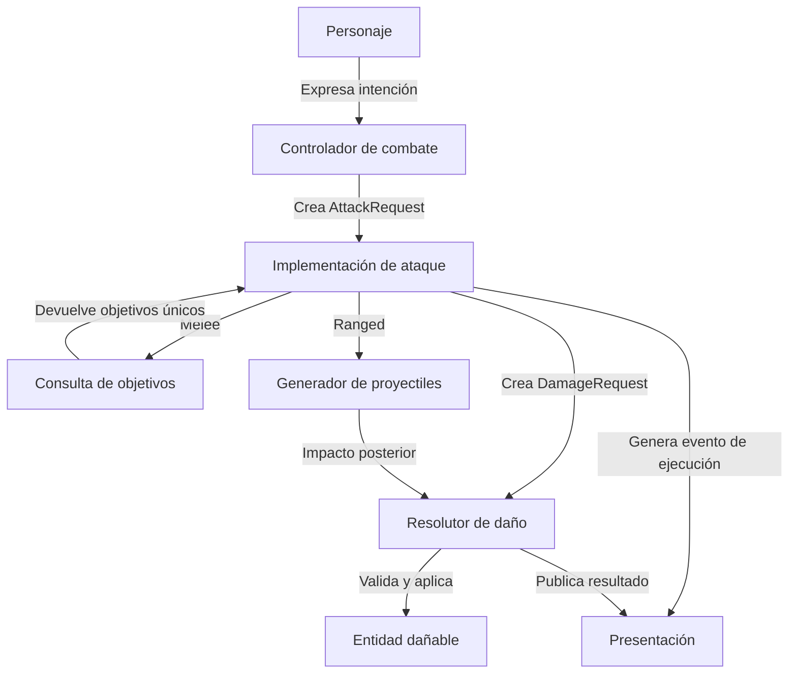
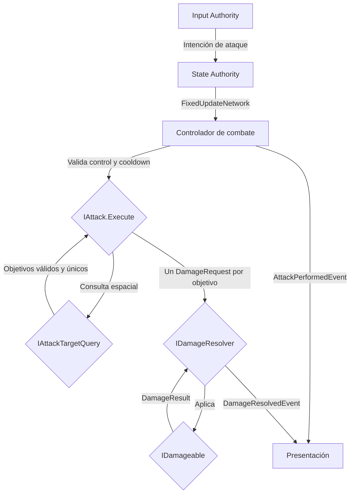
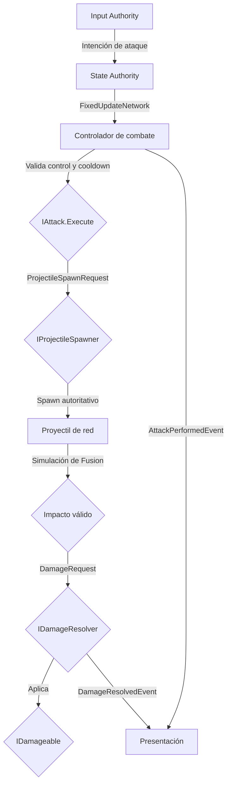

# Especificación de Contratos, Interfaces y Estructuras

> [!NOTE]
> **Proyecto:** Project Grimhold  
> **Estado:** Borrador v2  
> **Última modificación:** 2026-07-14

---

## Objetivo

Este documento define los contratos base y las estructuras de datos compartidas por los sistemas de personajes, combate, daño, interacción y presentación de **Project Grimhold**.

La especificación contempla desde el inicio:

- Ataques melee con cero, uno o varios objetivos.
- Ataques ranged cuya ejecución genera un proyectil y cuyo daño ocurre posteriormente al impactar.
- Un pipeline de daño común para jugadores, enemigos y futuras entidades.
- Simulación autoritativa con Photon Fusion sin acoplar el core a su API.
- Separación estricta entre gameplay y presentación.

### Principios de diseño

- **Desacoplamiento:** los contratos no dependen de `Player`, `Enemy`, `NPC` ni otras clases concretas.
- **Independencia de red:** el core no referencia tipos ni APIs de Photon Fusion.
- **Separación de presentación:** animaciones, VFX, SFX y UI consumen resultados o estados; nunca deciden el resultado del gameplay.
- **Autoridad:** el cliente con Input Authority expresa intención; la State Authority valida y ejecuta.
- **Datos inmutables:** requests, results y eventos no contienen estado runtime mutable.
- **Reutilización:** melee, ranged, enemigos y futuras armas utilizan los mismos contratos.
- **Responsabilidad única:** detectar objetivos, generar proyectiles, resolver daño y presentarlo son responsabilidades separadas.

---

## Arquitectura

### Relaciones principales



### Componentes conceptuales

| Sistema | Responsabilidad |
| :--- | :--- |
| **Personajes** | Exponen identidad y estado vital sin conocer implementaciones concretas de combate. |
| **Controlador de combate** | Lee intención, valida control y cooldown, selecciona la estrategia activa y solicita su ejecución. |
| **Ataques** | Ejecutan el comportamiento de una clase o arma sin modificar directamente la vida. |
| **Consulta de objetivos** | Aísla la detección espacial y el filtrado respecto de `Physics2D`. |
| **Proyectiles** | Se desplazan en la simulación y generan una solicitud de daño al impactar. |
| **Resolución de daño** | Localiza, valida y aplica solicitudes de daño sobre entidades registradas. |
| **Entidades dañables** | Gestionan salud, mitigaciones y muerte; devuelven el resultado final. |
| **Interacción** | Procesa acciones contextuales sobre objetos del mundo. |
| **Presentación** | Reacciona a eventos o estados de gameplay para reproducir animaciones y feedback. |

---

## Flujo de ataque melee



## Flujo de ataque ranged



> [!IMPORTANT]
> Ejecutar un ataque ranged y aplicar su daño son momentos distintos. El ataque se considera ejecutado cuando el proyectil es generado correctamente; el daño se resuelve únicamente cuando ese proyectil impacta.

---

## Contratos de identidad y entidades

### `EntityId`

Identificador estable e independiente de Photon. La capa de integración es responsable de mapearlo a `NetworkId` u otro identificador de infraestructura.

```csharp
using System;

public readonly struct EntityId : IEquatable<EntityId>
{
    public int Value { get; }

    public EntityId(int value)
    {
        Value = value;
    }

    public bool Equals(EntityId other) => Value == other.Value;

    public override bool Equals(object obj) =>
        obj is EntityId other && Equals(other);

    public override int GetHashCode() => Value;

    public override string ToString() => Value.ToString();

    public static bool operator ==(EntityId left, EntityId right) => left.Equals(right);
    public static bool operator !=(EntityId left, EntityId right) => !left.Equals(right);
}
```

### `IEntity`

```csharp
public interface IEntity
{
    EntityId Id { get; }
}
```

### `ICharacter`

Representa una entidad viva controlable o autónoma.

```csharp
public interface ICharacter : IEntity
{
    bool IsAlive { get; }
}
```

---

## Contratos de ataque

### `IAttacker`

Permite que un actor solicite un ataque sin conocer la implementación activa.

```csharp
public interface IAttacker
{
    AttackResult RequestAttack(in AttackRequest request);
}
```

### `IAttack`

Encapsula una estrategia concreta de ataque. No modifica salud directamente y no depende del Animator.

```csharp
public interface IAttack
{
    AttackType Type { get; }
    AttackResult Execute(in AttackRequest request);
}
```

Una implementación melee puede consultar varios objetivos y enviar un `DamageRequest` por cada `EntityId` único. Una implementación ranged solicita el spawn de un proyectil y finaliza sin aplicar daño inmediato.

### `AttackRequest`

Contiene exclusivamente información runtime del intento de ataque. Daño, rango, cooldown, tamaño de área, velocidad y demás reglas pertenecen a la configuración de la estrategia, no al request.

```csharp
using UnityEngine;

public readonly struct AttackRequest
{
    public EntityId AttackerId { get; }
    public Vector2 Origin { get; }
    public Vector2 Direction { get; }
    public int SimulationTick { get; }

    public AttackRequest(
        EntityId attackerId,
        Vector2 origin,
        Vector2 direction,
        int simulationTick)
    {
        AttackerId = attackerId;
        Origin = origin;
        Direction = direction.sqrMagnitude > 0f
            ? direction.normalized
            : Vector2.zero;
        SimulationTick = simulationTick;
    }
}
```

### `AttackResult`

Informa si el ataque pudo ejecutarse. No intenta representar impactos porque un ataque puede tener ninguno, varios o producirlos posteriormente.

```csharp
public readonly struct AttackResult
{
    public bool WasExecuted { get; }
    public AttackFailureReason FailureReason { get; }

    private AttackResult(
        bool wasExecuted,
        AttackFailureReason failureReason)
    {
        WasExecuted = wasExecuted;
        FailureReason = failureReason;
    }

    public static AttackResult Executed() =>
        new(true, AttackFailureReason.None);

    public static AttackResult Rejected(AttackFailureReason reason) =>
        new(false, reason);
}
```

### `AttackFailureReason`

```csharp
public enum AttackFailureReason
{
    None,
    ControlDisabled,
    CooldownActive,
    InvalidDirection,
    MissingConfiguration,
    MissingAuthority,
    ExecutionFailed
}
```

### `AttackType`

```csharp
public enum AttackType
{
    Melee,
    Ranged,
    AreaOfEffect
}
```

---

## Contratos de consulta de objetivos

La detección física debe quedar detrás de una abstracción para que la lógica melee no dependa directamente de una clase concreta ni mezcle reglas de combate con detalles de `Physics2D`.

### `AttackTargetQuery`

```csharp
using UnityEngine;

public readonly struct AttackTargetQuery
{
    public EntityId AttackerId { get; }
    public Vector2 Origin { get; }
    public Vector2 Direction { get; }
    public float Range { get; }
    public float Radius { get; }
    public int MaximumTargets { get; }

    public AttackTargetQuery(
        EntityId attackerId,
        Vector2 origin,
        Vector2 direction,
        float range,
        float radius,
        int maximumTargets)
    {
        AttackerId = attackerId;
        Origin = origin;
        Direction = direction.normalized;
        Range = range;
        Radius = radius;
        MaximumTargets = maximumTargets;
    }
}
```

### `AttackTarget`

```csharp
using UnityEngine;

public readonly struct AttackTarget
{
    public EntityId TargetId { get; }
    public Vector2 HitPoint { get; }

    public AttackTarget(EntityId targetId, Vector2 hitPoint)
    {
        TargetId = targetId;
        HitPoint = hitPoint;
    }
}
```

### `IAttackTargetQuery`

```csharp
using System.Collections.Generic;

public interface IAttackTargetQuery
{
    IReadOnlyList<AttackTarget> FindTargets(in AttackTargetQuery query);
}
```

La implementación Unity 2D debe:

- Filtrar por capas configurables.
- Excluir al atacante.
- Excluir entidades inválidas o muertas.
- Eliminar duplicados por `EntityId` aunque un objetivo tenga varios colliders.
- Respetar `MaximumTargets`.
- Evitar asignaciones por ataque cuando sea viable mediante buffers reutilizables o APIs non-alloc.

---

## Contratos de proyectiles

### `IProjectileSpawner`

Abstrae la creación del proyectil. La implementación de Photon Fusion realiza el spawn autoritativo sin exponer su API al core.

```csharp
public interface IProjectileSpawner
{
    ProjectileSpawnResult Spawn(in ProjectileSpawnRequest request);
}
```

### `ProjectileSpawnRequest`

```csharp
using UnityEngine;

public readonly struct ProjectileSpawnRequest
{
    public EntityId OwnerId { get; }
    public Vector2 Origin { get; }
    public Vector2 Direction { get; }
    public float Damage { get; }
    public DamageType DamageType { get; }
    public float Speed { get; }
    public float LifetimeSeconds { get; }
    public float MaximumRange { get; }
    public int SimulationTick { get; }

    public ProjectileSpawnRequest(
        EntityId ownerId,
        Vector2 origin,
        Vector2 direction,
        float damage,
        DamageType damageType,
        float speed,
        float lifetimeSeconds,
        float maximumRange,
        int simulationTick)
    {
        OwnerId = ownerId;
        Origin = origin;
        Direction = direction.normalized;
        Damage = damage;
        DamageType = damageType;
        Speed = speed;
        LifetimeSeconds = lifetimeSeconds;
        MaximumRange = maximumRange;
        SimulationTick = simulationTick;
    }
}
```

### `ProjectileSpawnResult`

```csharp
public readonly struct ProjectileSpawnResult
{
    public bool WasSpawned { get; }

    public ProjectileSpawnResult(bool wasSpawned)
    {
        WasSpawned = wasSpawned;
    }
}
```

> [!NOTE]
> La referencia al prefab es un dato de la configuración Unity de ranged y no forma parte del contrato puro. El adaptador `IProjectileSpawner` recibe o conoce esa configuración al construirse.

El proyectil debe conservar internamente al menos:

- `OwnerId`.
- Daño y tipo de daño.
- Dirección y velocidad.
- Tick de creación.
- Tiempo o tick de expiración.
- Distancia máxima.
- Estado de impacto consumido para impedir daño duplicado.

---

## Contratos de daño

### `IDamageable`

Gestiona internamente salud, mitigación y muerte. No conoce quién detectó el impacto ni cómo se presenta.

```csharp
public interface IDamageable : IEntity
{
    bool CanReceiveDamage { get; }
    DamageResult ApplyDamage(in DamageRequest request);
}
```

### `IDamageResolver`

Es el único punto del pipeline encargado de localizar el objetivo, validar la solicitud y delegar la aplicación sobre `IDamageable`.

```csharp
public interface IDamageResolver
{
    DamageResult Resolve(in DamageRequest request);
}
```

El resolver debe:

1. Localizar el objetivo mediante `TargetId`.
2. Verificar que exista y pueda recibir daño.
3. Rechazar solicitudes no autorizadas en la capa de integración de red.
4. Evitar que el atacante se dañe a sí mismo cuando la regla del ataque no lo permita.
5. Delegar mitigación, salud y muerte a `IDamageable`.
6. Devolver un resultado explícito.
7. Emitir o poner a disposición un `DamageResolvedEvent` para presentación.

### `DamageRequest`

```csharp
using UnityEngine;

public readonly struct DamageRequest
{
    public EntityId AttackerId { get; }
    public EntityId TargetId { get; }
    public float Amount { get; }
    public DamageType DamageType { get; }
    public Vector2 Direction { get; }
    public Vector2 HitPoint { get; }
    public int SimulationTick { get; }

    public DamageRequest(
        EntityId attackerId,
        EntityId targetId,
        float amount,
        DamageType damageType,
        Vector2 direction,
        Vector2 hitPoint,
        int simulationTick)
    {
        AttackerId = attackerId;
        TargetId = targetId;
        Amount = amount;
        DamageType = damageType;
        Direction = direction.normalized;
        HitPoint = hitPoint;
        SimulationTick = simulationTick;
    }
}
```

### `DamageResult`

```csharp
public readonly struct DamageResult
{
    public EntityId TargetId { get; }
    public bool IsApplied { get; }
    public float AppliedDamage { get; }
    public float RemainingHealth { get; }
    public bool IsFatal { get; }
    public DamageFailureReason FailureReason { get; }

    public DamageResult(
        EntityId targetId,
        bool isApplied,
        float appliedDamage,
        float remainingHealth,
        bool isFatal,
        DamageFailureReason failureReason)
    {
        TargetId = targetId;
        IsApplied = isApplied;
        AppliedDamage = appliedDamage;
        RemainingHealth = remainingHealth;
        IsFatal = isFatal;
        FailureReason = failureReason;
    }
}
```

### `DamageFailureReason`

```csharp
public enum DamageFailureReason
{
    None,
    InvalidAmount,
    InvalidTarget,
    TargetUnavailable,
    TargetDead,
    SelfDamageRejected,
    MissingAuthority,
    RejectedByTarget
}
```

### `DamageType`

```csharp
public enum DamageType
{
    Physical,
    Magical,
    TrueDamage
}
```

---

## Eventos de gameplay para presentación

Estos tipos transportan información consumible por presenters. No ejecutan animaciones ni contienen referencias a componentes visuales.

### `AttackPerformedEvent`

```csharp
using UnityEngine;

public readonly struct AttackPerformedEvent
{
    public EntityId AttackerId { get; }
    public AttackType AttackType { get; }
    public Vector2 Origin { get; }
    public Vector2 Direction { get; }
    public int SimulationTick { get; }

    public AttackPerformedEvent(
        EntityId attackerId,
        AttackType attackType,
        Vector2 origin,
        Vector2 direction,
        int simulationTick)
    {
        AttackerId = attackerId;
        AttackType = attackType;
        Origin = origin;
        Direction = direction.normalized;
        SimulationTick = simulationTick;
    }
}
```

### `DamageResolvedEvent`

```csharp
public readonly struct DamageResolvedEvent
{
    public DamageRequest Request { get; }
    public DamageResult Result { get; }

    public DamageResolvedEvent(
        DamageRequest request,
        DamageResult result)
    {
        Request = request;
        Result = result;
    }
}
```

### Reglas de presentación

- El evento de ataque se produce solo cuando `AttackResult.WasExecuted` es `true`.
- La presentación no inicia ni confirma daño.
- Deshabilitar un presenter no altera cooldowns, impactos, salud ni proyectiles.
- Los proxies remotos consumen estado sincronizado, contadores de secuencia o notificaciones de red generadas por la State Authority.
- La pérdida de una animación o un trigger visual no puede cancelar un ataque válido.

---

## Contratos de interacción

### `IInteractable`

```csharp
public interface IInteractable : IEntity
{
    bool CanInteract(in InteractionRequest request);
    InteractionResult Interact(in InteractionRequest request);
}
```

### `IPickup`

```csharp
public interface IPickup : IInteractable
{
}
```

### `InteractionRequest`

```csharp
public readonly struct InteractionRequest
{
    public EntityId InteractorId { get; }
    public EntityId TargetId { get; }
    public int SimulationTick { get; }

    public InteractionRequest(
        EntityId interactorId,
        EntityId targetId,
        int simulationTick)
    {
        InteractorId = interactorId;
        TargetId = targetId;
        SimulationTick = simulationTick;
    }
}
```

### `InteractionResult`

```csharp
public readonly struct InteractionResult
{
    public bool Success { get; }
    public bool IsConsumed { get; }
    public string ResultData { get; }

    public InteractionResult(
        bool success,
        bool isConsumed,
        string resultData)
    {
        Success = success;
        IsConsumed = isConsumed;
        ResultData = resultData;
    }
}
```

### `InteractionType`

```csharp
public enum InteractionType
{
    Trigger,
    Hold,
    Toggle
}
```

---

## Configuración de combate

Las configuraciones concretas pueden implementarse como `ScriptableObject`, siempre que no contengan estado runtime.

### Datos mínimos melee

- Daño.
- Tipo de daño.
- Cooldown en segundos.
- Alcance.
- Radio o tamaño del área.
- Cantidad máxima de objetivos.
- Máscara de capas o filtro de objetivos.

### Datos mínimos ranged

- Daño.
- Tipo de daño.
- Cooldown en segundos.
- Velocidad del proyectil.
- Tiempo de vida.
- Alcance máximo.
- Prefab de red del proyectil.
- Máscara de capas o filtro de objetivos.

### Reglas

- El input nunca aporta daño, rango, velocidad ni cooldown.
- El request runtime no puede sobrescribir la configuración.
- La configuración no almacena último tick, cooldown restante, objetivos golpeados ni referencias temporales.
- El controlador convierte el cooldown configurado a tiempo o ticks de simulación.
- La referencia a un prefab pertenece a la capa Unity, no a las estructuras del core.
- Las configuraciones pueden compartirse entre personajes o reutilizarse como base de futuras armas.

---

## Reglas de input y repetición

- Solo Input Authority captura la intención local.
- La intención se transmite como datos; no ejecuta ataques directamente.
- State Authority procesa la intención en `FixedUpdateNetwork`.
- La dirección de apuntado se normaliza antes de ejecutar.
- El ataque principal debe modelarse como una pulsación o transición de estado para evitar disparos repetidos al mantener el botón.
- El disparo continuo solo se habilita mediante una regla explícita de configuración y es controlado por cooldown de simulación.
- El input no conoce melee, ranged ni clases concretas.

---

## Sincronización con Photon Fusion

> [!IMPORTANT]
> Los siguientes puntos son reglas de integración. Los contratos anteriores permanecen independientes de Fusion.

### Autoridad

- **Input Authority:** captura botones y dirección o posición de apuntado.
- **State Authority:** valida control, cooldown, dirección, spawn, colisiones e impactos.
- **Proxies:** reciben estado sincronizado y reproducen presentación; no deciden resultados.

### Controlador de combate

- Se ejecuta en `FixedUpdateNetwork`.
- Solo procesa el input autorizado del personaje correspondiente.
- Utiliza tiempo de simulación, ticks o `TickTimer`; nunca `Time.time` para cooldowns de red.
- No depende del Animator.
- No aplica daño directamente.
- Puede habilitarse y deshabilitarse por estado de gameplay.

### Ataque melee

- La detección autorizada ocurre en State Authority.
- Se genera como máximo un `DamageRequest` por `EntityId` en cada ejecución.
- La presentación remota se deriva de un estado o evento sincronizado de ejecución.

### Proyectil ranged

- Solo State Authority realiza `Runner.Spawn` y `Runner.Despawn`.
- El proyectil se mueve dentro de la simulación de Fusion.
- El propietario y los datos necesarios para resolver el impacto son estado autorizado.
- El proyectil ignora a su propietario y consume el impacto una sola vez.
- Expira por tiempo de vida o alcance máximo.
- Todos los clientes observan el mismo objeto de red.

### Daño

- El atacante local nunca confirma un impacto.
- State Authority crea y resuelve cada `DamageRequest`.
- La salud restante y el estado de muerte se sincronizan desde la entidad dañable.
- La presentación de impacto consume el resultado confirmado, no una predicción visual como fuente de verdad.

---

## Dependencias de integración entre jugador y enemigo melee

Para que los ataques del jugador puedan dañar al enemigo melee, la implementación del enemigo debe proporcionar:

- Un `EntityId` estable y registrado.
- Collider o colliders detectables por el adaptador de consulta.
- Una capa o filtro compatible con combate.
- Implementación de `IDamageable`.
- Estado de salud bajo State Authority.
- Registro accesible para `IDamageResolver`.
- Exclusión correcta de colliders decorativos o zonas que no representen daño.

La ausencia de cualquiera de estos elementos es una dependencia de integración y no debe resolverse añadiendo lógica específica de enemigos dentro de melee, ranged o proyectiles.

---

## Decisiones explícitas de diseño

1. `IAttack.Execute` devuelve `AttackResult`, no `DamageRequest`.
2. `AttackResult` informa ejecución, no una lista de impactos.
3. `AttackRequest` no contiene daño, rango, cooldown ni tipo de ataque.
4. `IAttack.Type` identifica la estrategia activa.
5. Melee puede producir cero o varios `DamageRequest`.
6. Ranged produce un proyectil; el proyectil produce el `DamageRequest` al impactar.
7. Todo daño pasa por `IDamageResolver`.
8. `IDamageable` es responsable de salud, mitigación y muerte.
9. `SimulationTick` reemplaza timestamps ambiguos.
10. `EntityId` reemplaza identificadores `string` en operaciones frecuentes de gameplay.
11. La detección espacial está abstraída mediante `IAttackTargetQuery`.
12. El spawn de proyectiles está abstraído mediante `IProjectileSpawner`.
13. Gameplay y presentación se comunican mediante datos o estado, no mediante dependencias al Animator.

---

## Criterios de aceptación del documento

- [x] Los contratos soportan melee sin impacto, con un objetivo y multiobjetivo.
- [x] Los contratos soportan ranged con daño diferido mediante proyectiles.
- [x] Melee y ranged utilizan el mismo pipeline de daño.
- [x] Los ataques no modifican salud directamente.
- [x] El core no depende de Photon Fusion.
- [x] No existen dependencias a clases concretas de jugador o enemigo.
- [x] Requests y results no contienen estado runtime mutable.
- [x] La configuración no puede ser sobrescrita desde el input.
- [x] El tiempo de simulación está representado sin ambigüedad.
- [x] Se contempla deduplicación de objetivos con múltiples colliders.
- [x] La presentación no controla la aplicación de daño.
- [x] La seguridad y autoridad de red están definidas explícitamente.
- [x] Se documentan las dependencias necesarias para integrar al enemigo melee.