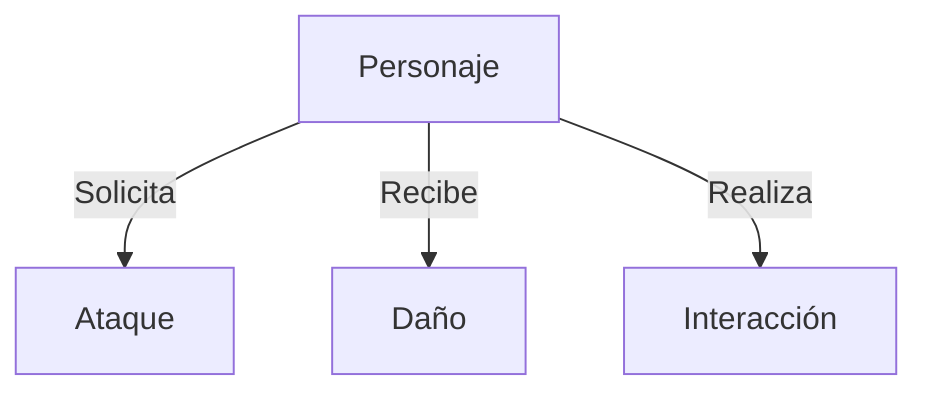
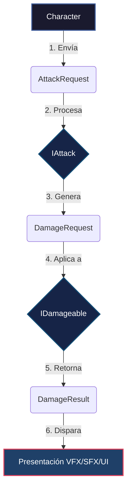

# Especificación de Contratos, Interfaces y Estructuras

> [!NOTE]
> **Proyecto:** Project Grimhold  
> **Estado:** Borrador v1  
> **Última Modificación:** 2026-07-14

---

## Objetivo

Este documento define los contratos base, interfaces y estructuras de datos que formarán los cimientos de todos los sistemas de gameplay de **Project Grimhold**.

### Principios de Diseño
* 🔌 **Desacoplamiento Total:** Independientes de Photon Fusion.
* 🧩 **Abstracción:** Sin dependencia de clases concretas (`Player`, `Enemy`, `NPC`).
* 🖥️ **Separación de Presentación:** Sin lógica visual o de sonido (VFX/SFX).
* 🌐 **Simulación Pura:** Sin lógica de red directa en el core.
* ♻️ **Reutilización:** Diseñado para ser extensible y reusable.

---

## Arquitectura

### Relaciones del Personaje


### Componentes Conceptuales

| Sistema | Responsabilidad |
| :--- | :--- |
| **Personajes** | Solicitan y coordinan acciones básicas del juego. |
| **Ataques** | Detentan e identifican objetivos dentro del alcance. |
| **Daño** | Valida la legitimidad, calcula mitigaciones y aplica el daño. |
| **Interacción** | Procesa las acciones iniciadas sobre objetos interactivos en el mundo. |
| **Presentación** | Capa visual/sonora que reacciona a los resultados del gameplay (VFX, SFX, animaciones). |

---

## Flujo de Ataque y Daño

A continuación se muestra el ciclo de vida desde la solicitud de un ataque hasta su presentación visual:



---

## Interfaces Contrato

### `ICharacter`
* **Responsabilidad:** Representar la entidad base para cualquier personaje controlable o autónomo en el juego.
```csharp
public interface ICharacter
{
    string Id { get; }
    bool IsAlive { get; }
}
```

### `IDamageable`
* **Responsabilidad:** Recibir solicitudes de daño, aplicar lógica interna de mitigación/salud, y devolver el resultado del impacto.
```csharp
public interface IDamageable
{
    DamageResult ApplyDamage(DamageRequest request);
}
```

### `IAttacker`
* **Responsabilidad:** Habilitar a un actor para iniciar solicitudes de ataque.
```csharp
public interface IAttacker
{
    AttackResult RequestAttack(AttackRequest request);
}
```

### `IAttack`
* **Responsabilidad:** Encapsular la detección espacial de objetivos (colisiones, rangos) y originar las peticiones de daño.
```csharp
public interface IAttack
{
    DamageRequest ExecuteAttack(AttackRequest request);
}
```

### `IInteractable`
* **Responsabilidad:** Procesar acciones contextuales de interacción sobre objetos del entorno.
```csharp
public interface IInteractable
{
    InteractionResult Interact(InteractionRequest request);
    bool CanInteract(InteractionRequest request);
}
```

### `IPickup`
* **Responsabilidad:** Especialización de `IInteractable` para representar objetos que pueden ser añadidos al inventario o consumidos al tacto.

---

## Estructuras de Datos

### `DamageRequest`
Estructura inmutable que encapsula la información de un intento de daño.

| Campo | Tipo | Descripción |
| :--- | :--- | :--- |
| `AttackerId` | `string` | Identificador del originador del daño. |
| `TargetId` | `string` | Identificador de la entidad receptora. |
| `Amount` | `float` | Cantidad bruta de daño solicitado. |
| `DamageType` | `DamageType` | Categoría o elemento del daño. |
| `Direction` | `Vector3` | Dirección del vector de impacto. |
| `HitPoint` | `Vector3` | Punto exacto de contacto en el espacio 3D/2D. |
| `Timestamp` | `double` | Marca de tiempo del tick de la simulación. |

---

### `DamageResult`
Resultado devuelto por una entidad al procesar un `DamageRequest`.

| Campo | Tipo | Descripción |
| :--- | :--- | :--- |
| `IsApplied` | `bool` | `true` si el daño fue procesado y afectó la salud. |
| `AppliedDamage` | `float` | Cantidad neta de daño tras defensas/mitigación. |
| `RemainingHealth` | `float` | Vida restante de la entidad después del impacto. |
| `IsFatal` | `bool` | Indica si el daño redujo la vida a 0, provocando la muerte. |

---

### `AttackRequest`
Parámetros provistos al iniciar un ataque.

| Campo | Tipo | Descripción |
| :--- | :--- | :--- |
| `AttackerId` | `string` | Identificador de la entidad que ataca. |
| `AttackType` | `AttackType` | Tipo o habilidad utilizada. |
| `Origin` | `Vector3` | Punto de origen del ataque. |
| `Direction` | `Vector3` | Vector de dirección del ataque. |
| `Range` | `float` | Alcance máximo del ataque. |
| `Timestamp` | `double` | Tick o marca temporal del inicio. |

---

### `AttackResult`
Información de retorno tras la ejecución y detección del ataque.

| Campo | Tipo | Descripción |
| :--- | :--- | :--- |
| `Success` | `bool` | Indica si el ataque se ejecutó (ej. no estaba en cooldown). |
| `HasHit` | `bool` | `true` si el ataque colisionó con algún objetivo válido. |
| `HitTargetId` | `string` | Identificador del primer objetivo detectado (si aplica). |

---

### `InteractionRequest`
Parámetros necesarios para disparar una interacción.

| Campo | Tipo | Descripción |
| :--- | :--- | :--- |
| `InteractorId` | `string` | Identificador de la entidad que interactúa. |
| `TargetId` | `string` | Identificador del objeto interactivo. |
| `Timestamp` | `double` | Marca de tiempo del evento. |

---

### `InteractionResult`
Respuesta de un objeto tras ser interactuado.

| Campo | Tipo | Descripción |
| :--- | :--- | :--- |
| `Success` | `bool` | `true` si la interacción fue exitosa y completada. |
| `IsConsumed` | `bool` | Indica si el objeto interactivo debe ser destruido o desactivado. |
| `ResultData` | `string` | Metadatos lógicos adicionales sobre el resultado. |

---

## Enumeraciones

```csharp
public enum DamageType
{
    Physical,
    Magical,
    TrueDamage
}

public enum AttackType
{
    Melee,
    Ranged,
    AreaOfEffect
}

public enum InteractionType
{
    Trigger,
    Hold,
    Toggle
}
```

---

## Sincronización (Photon Fusion)

> [!IMPORTANT]
> **Reglas de Red y Autoridad:**
> * **Desacoplamiento:** Los contratos e interfaces no conocen clases ni APIs de Photon Fusion.
> * **State Authority:** La lógica autorizada se ejecuta exclusivamente en el peer que posee **State Authority**.
> * **Input Authority:** Los clientes únicamente capturan y solicitan acciones transmitiendo inputs estructurados.
> * **No Confianza:** El atacante local nunca decide o confirma el impacto o daño aplicado.
> * **Sincronización:** La autoridad valida la colisión, aplica los cambios de estado en sus propiedades `[Networked]` y propaga el resultado a los proxies.

---

## Criterios de Aceptación

- [x] **Compilación Aislada:** Compilan en un ensamblado de lógica pura.
- [x] **Cero Concreción:** Sin acoplamiento a clases finales.
- [x] **Polimorfismo:** Igualmente utilizables para jugadores, enemigos y NPCs.
- [x] **Trazabilidad:** El daño identifica inequívocamente al atacante y al objetivo.
- [x] **Ciclo de Vida:** El resultado reporta la salud final y estado de vitalidad.
- [x] **Puntualidad Visual:** Cero llamadas o referencias a presentación, delegadas a callbacks o observadores de estado.
- [x] **Seguridad de Red:** El cliente atacante carece de autoridad para validar el daño.
