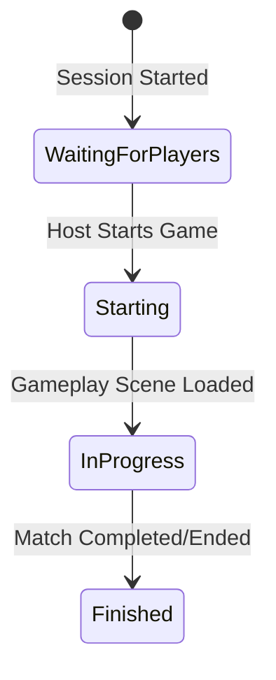

# Session Lifecycle & Spawning Architecture

This document specifies the lifecycle phases of a multiplayer session, the authoritative flow for starting a match, late join prevention mechanisms, and defensive validations executed before player spawning.

---

## 1. Match Phases

The match coordinator (`NetworkMatchController`) maintains a single synchronized network state (`[Networked] MatchPhase Phase`) that defines the game's progress. 



The phases are defined as follows:
* **`WaitingForPlayers`**: The lobby phase. New clients can discover and connect to the session, and select classes.
* **`Starting`**: Transition phase initiated by the Host. The session is closed and hidden, and scene loading begins.
* **`InProgress`**: Gameplay is active. Spawned players are participating.
* **`Finished`**: The match has ended.

---

## 2. Prefab Coordinator and Lifecycle

The coordinator `NetworkMatchController` is spawned by the Host from a registered network prefab (`_matchControllerPrefab` in `FusionSessionLauncher`). 
- **Managed Persistence**: Instead of relying on local Unity calls, the coordinator is spawned with the flag `NetworkSpawnFlags.DontDestroyOnLoad` to let Photon Fusion manage its persistence across scene loads.
- **No DontDestroyOnLoad**: The coordinator does not call `UnityEngine.Object.DontDestroyOnLoad` directly.
- **Authority initialization**: `Phase` is initialized to `WaitingForPlayers` inside `Spawned()` on the State Authority (Host/Server).
- **Scene Load validation**: Prior to scene loading, the scene path is validated. The phase is set to `Starting`, and the session is closed (`IsOpen = false`, `IsVisible = false`). On load failure, the phase does not advance to `InProgress`.

---

## 3. Runner-Scoped Dependencies

- **Spawn Manager**: `NetworkSpawnManager` resides on the persistent runner GameObject. It is initialized explicitly via `InitializeForRunner` prior to `StartGame`.
- **Single Callback Registration**: Fusion automatically registers the spawn manager component as a callback listener of the runner GameObject, avoiding duplicate manual registrations.
- **Explicit Binding**: Once the coordinator is spawned on the Host, the launcher binds it to the spawn manager using `BindMatchController`. Clients bind the replicated coordinator in its `Spawned()` method.
- **Shutdown Cleanup**: When `OnShutdown` triggers, the manager clears all registries, unbinds the coordinator, and sets `_runner = null` to prevent reuse of dead runner instances.

---

## 4. Scene Load Identity & Loading States

To avoid duplicate entity spawning and allow recarrying or reloading the same scene path cleanly, the spawner uses an incremental load generation ID engine instead of path-based strings:

* **Scene Load States**:
  - `None`: No scene is currently loaded or processing.
  - `Pending`: Scene loading started.
  - `Processing`: The scene finished loading and is currently resolving configuration and spawning initial entities.
  - `Failed`: An error occurred during lookup, validation, or spawning. Spawning remains locked.
  - `Completed`: Scene configuration and initial spawning finished successfully. Spawns are unblocked.

* **OnSceneLoadStart**: When a load starts, `OnSceneLoadStart` increments the generation counter (`_currentSceneLoadGeneration`), sets the state to `Pending`, clears spatial configuration lookups, and locks active spawning (`_spawnsBlocked = true`).
* **OnSceneLoadDone**: Sets state to `Processing` immediately before resolving configurations to prevent duplicate executions from repeated callbacks. Spawns the characters and initial entities. On success, sets state to `Completed` and unblocks spawns (`_spawnsBlocked = false`). On failure, the state becomes `Failed` and spawning remains locked. No auto-rebuild is attempted on failed generations; a reload is required.

Loot spawning has an additional runner-local generation record. `InitialLootSpawnState` remains storage-only: the manager records a point only after Fusion returned the expected object, the pre-spawn override was applied, `NetworkLootContainer` initialized, and the production container became available. Duplicate callbacks therefore cannot produce a second batch. A failed instance is despawned authoritatively and leaves the point unrecorded; a retry in the same generation derives the same seed and roll. `InitializeForRunner`, the next scene-load generation, and `OnShutdown` clear the point record so a new generation can spawn its own clean batch. This record is non-static and does not claim containers spawned by other systems.

---

## 5. Separation of Configurations & Scene Resolution

Configurations are split between persistent data and scene-specific spatial layouts:
- **Persistent Configuration**: Player and enemy prefab catalogs are owned by the launcher and passed to the runner-scoped `NetworkSpawnManager` during initialization. Gameplay's scene-configured manager contributes the explicit `LootContainer.prefab` reference through `CopyReferencesFrom`; the duplicate component is then destroyed while its colocated spatial configuration remains.
- **Scene Configuration**: Scene-specific spawn points and entity quantities are stored in `NetworkSpawnSceneConfiguration` components located in the respective scenes.
- **Runner-Scoped Scene Resolution**: The manager resolves configurations strictly within the roots and children of `runner.SceneManager.MainRunnerScene`. Falling back to the active scene is prohibited.
- **Scene Config Validation**: Spawn points inside `NetworkSpawnSceneConfiguration` must belong to the same scene structure. If multiple configurations are found in the same scene, the pipeline fails closed.
- **Strict Ordering**: Upon loading a scene, the configuration is applied first, then pending players are spawned, and finally scene entities are spawned.

Initial scene groups use an explicit dispatch policy:

```text
Players -> SpawnPlayer
Enemies -> SpawnEnemy
Loot -> SpawnLootContainer
Breakables -> SpawnBreakable
NPCs / Bosses / Misc -> warning and skip
```

An unsupported group never falls back to an enemy prefab. A missing loot-container reference reports a contextual error and skips only `Loot`; player and enemy processing continues.

Breakables use the same point-bounded, generation-idempotent initial spawning
policy. State Authority validates and rolls their weighted drop content before
spawning, using a group-discriminated seed so container and breakable points do
not share random streams. See `Docs/Architecture/BreakableLootArchitecture.md`.

Gameplay configures `SpawnGroupType.Loot` with ordered scene transforms. The Host/Server spawns `LootContainer.prefab` without Input Authority, using loop index `0..N-1` as stable point identity. One cryptographic session seed is created locally on the authoritative runner; a pure 64-bit mixer combines it with scene-load generation and point index. The manager validates the prefab table, random-content component, loot table, catalog, weights, quantities and capacities before spawning. It rolls an immutable snapshot and applies the result with Fusion 2.1.1 `OnBeforeSpawned`; clients never roll or receive a seed. When requested amount exceeds point count, it is clamped to the available points with a warning, so an initial generation never overlaps two containers on one point.

`OnBeforeSpawned` is synchronous but returns `void` and is not a cancellation mechanism. After `runner.Spawn`, the manager verifies the returned identity, callback result, container initialization and final availability. Any failure causes immediate State Authority despawn and prevents point registration. A missing prefab, disabled random configuration or invalid table skips only Loot; player and enemy spawning continues. The synchronized container dictionary is the only replicated result, so late joiners receive existing content without rerolling.

---

## 6. Declarative Spawning Policy (Spawn-Point-Based vs Explicit-Transform)

Spawning behaviour per scene is explicitly declared via the serialized `SceneSpawnPointPolicy` configuration component:

* **SceneSpawnPointPolicy**:
  - `NotRequired`: The scene does not contain or require spawn points. Scene-point-based spawning methods are disabled. Mark loading as `Completed` without generating objects.
  - `Required`: The scene requires a valid configuration with configured spawn points. If missing or invalid, the load generation fails closed.

* **SceneSpawnConfigurationStatus**:
  - `None`: Spawning configuration status has not been evaluated.
  - `SpawnPointsNotRequired`: Non-point spawning mode is active.
  - `SpawnPointsReady`: Spawn points lookup has been successfully built and validated.
  - `Invalid`: The configuration was missing, duplicated, or invalid. Spawning remains locked.

* **CanUseCurrentSceneSpawnPoints**: Used for scene-point-based spawns (dependent on spawn points lookup). Requires `Completed` load state and `SpawnPointsReady` status.
* **CanSpawnAtExplicitTransform**: Used for explicit-transform spawns (using explicit `Vector3` coordinates). Validates runner authority without consuming points configured.

---

## 7. Fail-Closed Spawn Policy

Player spawning is protected by a strict fail-closed validation policy. `CanSpawnPlayer` returns `false` if:
* The runner does not match the associated runner.
* Spawning is blocked (`_spawnsBlocked` is true).
* The coordinator is missing or belongs to another runner.
* The player is not registered in `_admittedPlayers`.
* The player already has a character spawned in `_spawnedPlayers` or registered via `runner.GetPlayerObject(player)`.
* The current phase is not `WaitingForPlayers`, `Starting`, or `InProgress`.
* The required class catalog or spawn configuration is missing.

---

## 8. PlayerRef Reusability

- **PlayerRef Reusability**: `PlayerRef` values are reusable by Photon Fusion across sessions or connection handshakes. The registry tracks authorized active connection states; late joins are rejected, preventing slots from being hijacked by unadmitted players.

---

## 9. Launcher and Secure Shutdown

- **Try-Finally Safety**: The launcher's `StartSessionAsync` wraps the startup sequence in a `try/finally` block to guarantee `_isStarting` is reset to `false` in all execution paths.
- **Controlled Shutdown**: Any failure after `StartGame` triggers `ShutdownAndDestroyRunnerAsync()`. It calls `runner.Shutdown()` asynchronously and destroys the runner GameObject, ensuring clean releases of network slots and resources.
